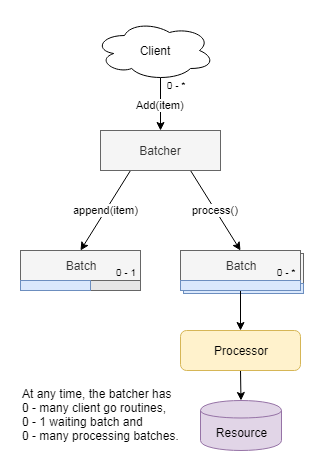

# Batchy

A nice little package with no dependencies for fan-in batching of highly concurrent workloads

[](https://godoc.org/github.com/kevburnsjr/batchy)
[](https://goreportcard.com/report/github.com/kevburnsjr/batchy)
[](http://gocover.io/github.com/kevburnsjr/batchy)

The throughput of APIs, web services and background workers can sometimes be improved by orders of magnitude
through the introduction of artificial latency in support of concurrent batching. These efficiency improvements
can result in increased service stability and total system throughput while lowering infrastructure costs.

This is a general purpose library for concurrent batching of any sort of operation one might desire. It could
be used to batch SQL inserts, API calls, disk writes, queue messages, stream records, emails, etc. The batcher
hides asynchronous processing behind a syncronous interface.



## How to use it

```go
// 100 max batch size
// 100 milliseconds max batch wait time
var table1 = batchy.New(100, 100*time.Millisecond, func(items []interface{}) (errs []error) {
	q := fmt.Sprintf(`INSERT INTO table1 (data) VALUES %s`,
		strings.Trim(strings.Repeat(`(?),`, len(items)), ","))
	_, err := db.Exec(q, items...)
	if err != nil {
		errs = make([]error, len(items))
		for i := range errs {
			errs[i] = err
		}
	}
	return
})
```
```go
// Call to Add blocks calling go routine for up to 100ms + processing time.
// If batch is filled before wait time expires, blocking will be reduced.
// Wait time begins when the first item is added to a batch.
err := table1.Add("data")
```

## Examples

See examples below for more complete integrations

- [Disk Write Batching](_examples/disk)  
6x throughput improvement  

- [Database Write Batching](_examples/db)  
3x - 15x throughput improvement plus reduced failure rate  

- [Using Interfaces](_examples/interfaces)  
Integration guide. See Design section below  

## Design

This package makes use of Go's empty interface `interface{}`. For this reason, it is best not to export
any `Batcher` directly from your package. Instead the batcher should be hidden behind an existing synchronous
interface.

Suppose you have the following code that writes bytes to a file:

```go
package repo

import (
	"io/ioutil"
)

type DataWriter interface {
	Write(data []byte) error
}

type dataWriter struct{}

func (r *dataWriter) Write(data []byte) error {
	return ioutil.WriteFile("test1", data, 0644)
}

func NewDataWriter() *dataWriter {
	return &dataWriter{}
}
```

You could create a batched version that satisfies the same interface:
```go
package repo

import (
	"io/ioutil"
	"time"

	"github.com/kevburnsjr/batchy"
)

type dataWriterBatched struct {
	batcher batchy.Batcher
}

func (r *dataWriterBatched) Write(data []byte) error {
	return r.batcher.Add(data)
}

func NewDataWriterBatched(maxItems int, maxWait time.Duration) *dataWriterBatched {
	return &dataWriterBatched{batchy.New(maxItems, maxWait, func(items []interface{}) (errs []error) {
		var data []byte
		for _, d := range items {
			data = append(data, d.([]byte)...)
		}
		err := ioutil.WriteFile("test2", data, 0644)
		if err != nil {
			errs = make([]error, len(items))
			for i := range errs {
				errs[i] = err
			}
		}
		return
	})}
}
```

Now during dependency injection just replace

```go
dw := repo.NewDataWriter()
dw.Write([]byte("asdf"))
```

with

```go
dw := repo.NewDataWriterBatched()
dw.Write([]byte("asdf"))
```

and your code shouldn't need to know the difference because you've used interfaces to effectively hide the
implementation details (in this case, the use of batching).

## Why

I created this repository because:

1) I frequently see gophers get concurrent batching wrong.
2) I frequently see gophers avoid batching altogether because concurrency is hard.
3) I frequently need this sort of batching and I'd rather not solve the same problem differently for every project.
4) I want to help save the planet by making everyone's systems more energy efficient.

## Benchmarks

```
$ go test ./... -bench=. -benchmem

BenchmarkBatcher/itemLimit_10-12          1000000   1042 ns/op   207 B/op   3 allocs/op
BenchmarkBatcher/itemLimit_20-12          2104995    582 ns/op   110 B/op   2 allocs/op
BenchmarkBatcher/itemLimit_100-12         2558310    479 ns/op    80 B/op   1 allocs/op
BenchmarkBatcher/itemLimit_1000-12        2860184    425 ns/op    66 B/op   1 allocs/op
BenchmarkBatcher100ms/itemLimit_10-12     1002462   1188 ns/op   182 B/op   2 allocs/op
BenchmarkBatcher100ms/itemLimit_20-12     1490853    865 ns/op   110 B/op   1 allocs/op
BenchmarkBatcher100ms/itemLimit_100-12    2189893    592 ns/op    65 B/op   1 allocs/op
BenchmarkBatcher100ms/itemLimit_1000-12   2211993    499 ns/op    51 B/op   1 allocs/op
PASS
ok      github.com/kevburnsjr/batchy    21.737s
```
